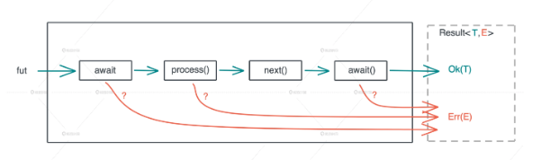

# Error handling in Rust

## 介绍错误处理系统

我们平时写练习代码，一般只会关注正常路径，可以对小概率发生的错误路径置之不理；**但在实际生产环境中，任何错误只要没有得到妥善处理，就会给系统埋下隐患，轻则影响开发者用户体验，重则会给系统带来安全上的问题。**

控制流程是语言的核心流程，而错误处理又是控制流程的重要组成部分。


错误处理的几个主流处理方式

1. 使用返回值，结合错误码，C 语言大量采用这种方式；这种方式的问题是**在调用者调用时，错误就必须得到处理或者显式的传播。**

2. 使用异常，**错误的产生和错误的处理完全被分隔开，调用者不必关心错误，而被调者也不强求调用者关心错误。** 异常处理的开销比较大，很容易造成滥用。

3. 使用类型系统，错误信息既然可以通过已有的类型携带，或者通过多返回值的方式提供，那么通过类型来表征错误，使用一个内部包含正常返回类型和错误返回类型的复合类型，通过类型系统来强制错误的处理和传递。

错误处理本身是一项系统性的工作，有必要非常好的掌握。

### 错误的分类

- 不可恢复错误

  - 有些错误，我们碰到了后需要及早退出程序，或者直接不启动程序，而是打出错误信息。

  - Rust 提供的支持：panic!, todo!, unimplemented!, unreachable!

- 可恢复错误

  - 在遇到后，不应该让整个程序直接停止运行，而是在代码逻辑中分析可能的错误原因，要么尝试恢复性的处理方案，要么给用户返回自定义的错误信息，让用户明白任务未达到预期的原因。

## Rust 里的错误处理

`Rsult<T, E>` 是 Rust 定义的用来承载可能会出错的函数返回值，这是一个一般性的定义，比如 E 并没有规定具体的类型；Result 可以包裹错误类型和正常的类型，通过返回值把数据返回给调用层，由逻辑层决定如何处理错误，或者继续往上传递。

`Option<T>` 是另外一个经常使用的 enum，它用来代表有值和无值两种情况；对 Rust 的错误处理起到了辅助的作用，Rust 中并没有 null 之类的类型，每个值在使用前都必须初始化，如何表示不存在的情况，可以使用 `Option::None`。

### `?` 操作符

会展开成如下形式的代码

```rust
match result {
  Ok(v) => v,
  Err(e) => return Err(e.into())    // 注意这里是 return
}
```

如下代码的执行流程

```rust
fut
  .await?
  .process()?
  .next()
  .await?;
```



`?` 操作符使用起来简单方便，主要用于错误的传播，简化代码结构，但要注意不同的错误类型之间是无法直接使用的，需要使用 From trait 在两个类型之间建立转换的桥梁。

### 常用操作

- `Option<T>`

  - 解包：unwrap, expect, unwrap_or_default

  - map, cloned, is_some, is_none, as_ref, as_mut, take, replace, and_then

- `Result<T, E>`

  - 解包：unwrap, expect, unwrap_or_default

  - map, is_ok, is_err, as_ref, as_mut, and_then, map_err

- Option.ok_or -> Reuslt

- Result.ok -> Option, Result.err -> None

### 标准库中的 Error trait

```rust
pub trait Error: Debug + Display {
    fn source(&self) -> Option<&(dyn Error + 'static)> { ... }
    fn backtrace(&self) -> Option<&Backtrace> { ... }
    fn description(&self) -> &str { ... }
    fn cause(&self) -> Option<&dyn Error> { ... }
}
```

`Result<T, E>`  里 E 是一个代表错误的数据类型，并没有做任何的规范和限制，为了规范这个错误的类型和行为，Rust 定义了 Error trait，试图让错误处理更加优雅、让大型的工程实践更加易用。

一般做法：我们定义自己的错误类型体系，并为每个错误类型实现 Error trait，可想而知这会带来很多的模版代码，并且代码量也会非常大；但是这类工作已经有人做了，`anyhow` 和 `thiserror` 这两个 crate 就提供了。

- thiserror 提供了派生宏来简化错误类型的定义，比如下面这样

```rust
#[derive(Error, Debug)]
enum DataStoreError {
    #[error("data store disconnected")]
    Disconnect(#[from] std::io::Error),
    #[error("the data for key `{0}` is not available")]
    Redaction(String),
    #[error("invalid header (expected {expected:?}, found {found:?})")]
    InvalidHeader {
        expected: String,
        found: String,
    },
    #[error("unknown data store error")]
    Unknown,
}
```

实际上，只要为 struct 或 enum 的成员提供 `#[error("...")]` 定义，就会实现 `Display`，类似

1. `#[error("{var}")]` ⟶ `write!("{}", self.var)`

2. `#[error("{0}")]` ⟶ `write!("{}", self.0)`

3. `#[error("{var:?}")]` ⟶ `write!("{:?}", self.var)`

4. `#[error("{0:?}")]` ⟶ `write!("{:?}", self.0)`

### 最佳实践

一个完整的错误系统包括：错误的构造和表示、错误的传递、错误的处理。

std, anyhow 和 thiserror 一起构成了 Rust 语言错误处理的最佳实践。

## Reference

- [08 ｜ Option&lt;T&gt;与 Result&lt;T, E&gt;、迭代器-Rust 语言从入门到实战-极客时间](https://time.geekbang.org/column/article/722702)

- [18 ｜错误处理系统：错误的构建、传递和处理-Rust 语言从入门到实战-极客时间](https://time.geekbang.org/column/article/729009)

- [18 ｜错误处理：为什么 Rust 的错误处理与众不同？-陈天 · Rust 编程第一课-极客时间](https://time.geekbang.org/column/article/424002)

- [anyhow - Rust](https://docs.rs/anyhow/latest/anyhow/index.html)

- [thiserror - Rust](https://docs.rs/thiserror/latest/thiserror/)

- [蚂蚁集团 CeresDB 团队 | 关于 Rust 错误处理的思考 - Rust 精选](https://rustmagazine.github.io/rust_magazine_2021/chapter_2/rust_error_handle.html)

- [anyhow 和 thiserror - 错误处理库](https://rustcc.cn/article?id=6dcbf032-0483-4980-8bfe-c64a7dfb33c7)
