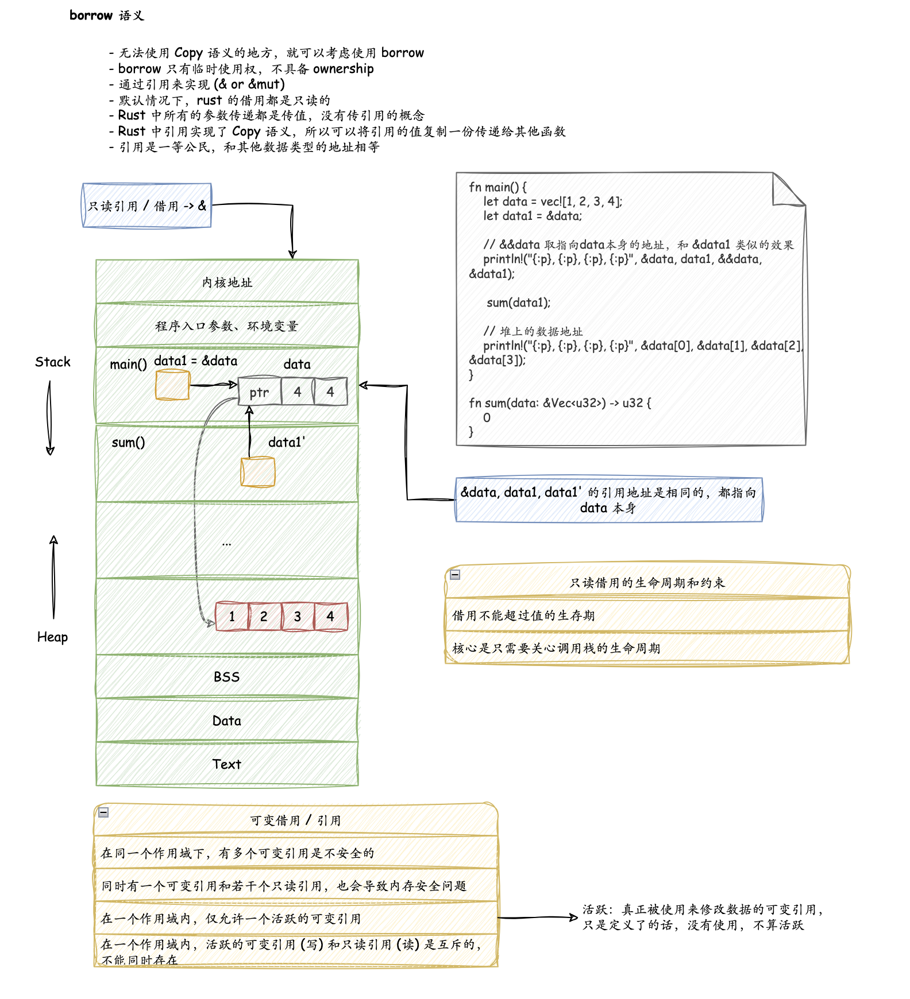
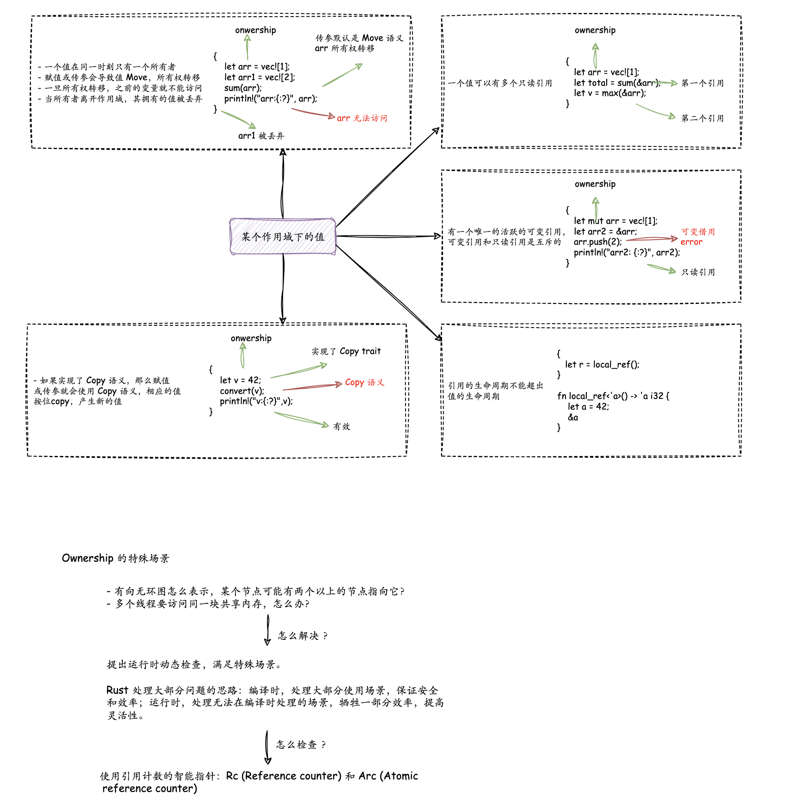

# Borrow

当你不希望值的所有权被转移，又因为没有实现 Copy trait 而无法使用 Copy 语义，怎么办？

Borrow 语义允许一个值的所有权，在不发生转移的情况下，被其它上下文使用。就好像住酒店或者租房那样，旅客 / 租客只有房间的临时使用权，但没有它的所有权。另外，Borrow 语义通过引用语法（& 或者 &mut）来实现。

Rust 没有传引用的概念，Rust 所有的参数传递都是传值，不管是 Copy 还是 Move。所以在 Rust 中，你必须显式地把某个数据的引用，传给另一个函数。

Rust 的引用实现了 Copy trait，所以按照 Copy 语义，这个引用会被复制一份交给要调用的函数。对这个函数来说，它并不拥有数据本身，数据只是临时借给它使用，所有权还在原来的拥有者那里。

在 Rust 里，引用是一等公民，和其他数据类型地位相等。

