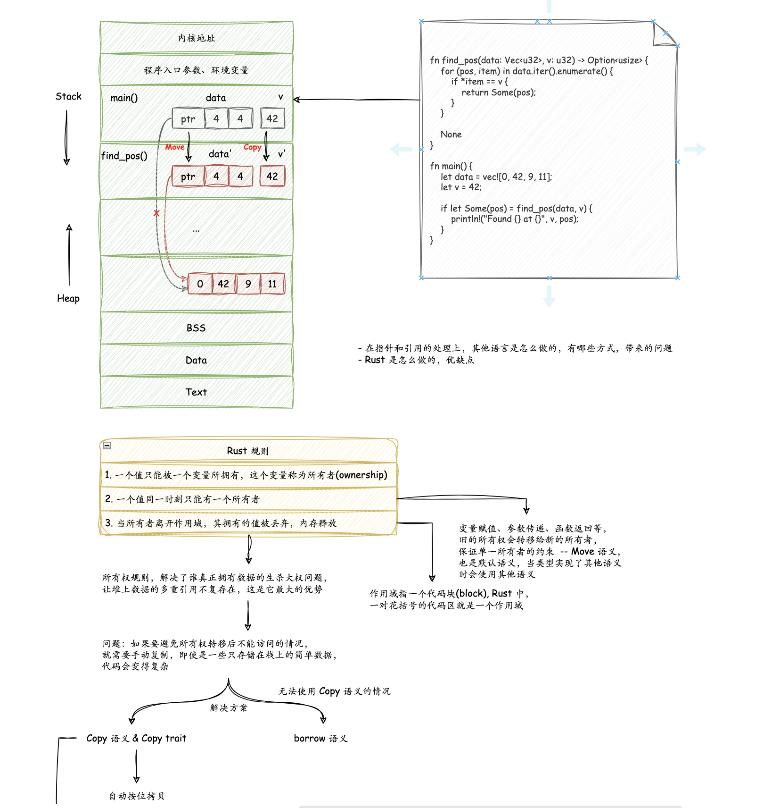
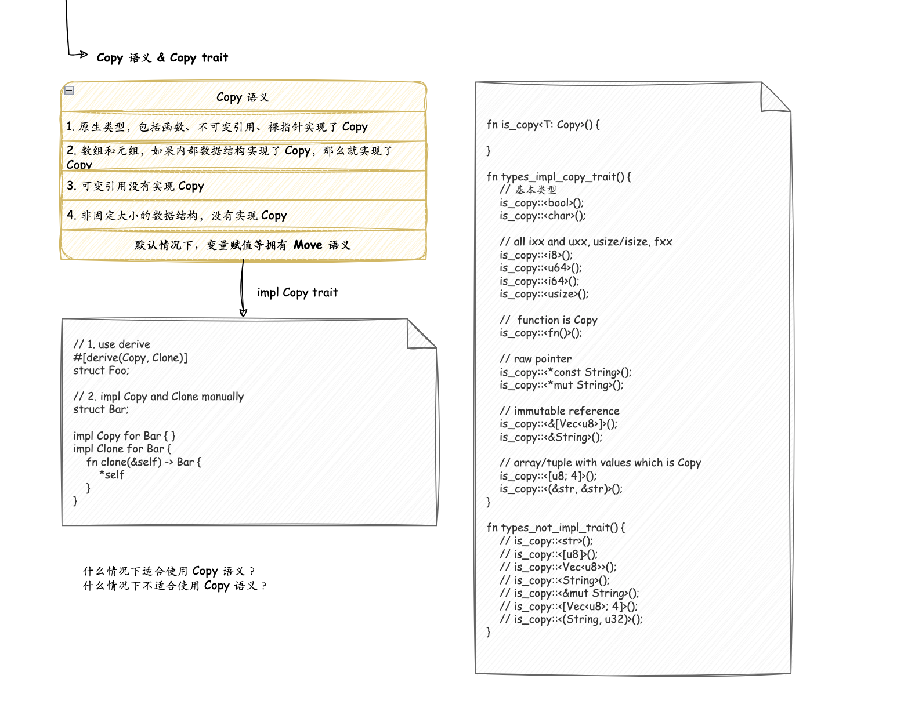

# Ownership & Lifetime

内存相关

- 创建值的时候，什么时候分配在栈上，什么时候分配在堆上？
  
  - 栈
    
    - 在编译时，一切无法确定大小或者大小可以改变的数据，都无法安全地放在栈上，最好放在堆上。
    
    - 栈上的内存分配是非常高效的。只需要改动栈指针（stack pointer），就可以预留相应的空间；把栈指针改动回来，预留的空间又会被释放掉。预留和释放只是动动寄存器，不涉及额外计算、不涉及系统调用，因而效率很高。
    
    - 栈的缺点：Stack 的容量是有限制的，这主要是考虑到调用栈的大小，避免栈溢出（stack overflow）。一旦当前程序的调用栈超出了系统允许的最大栈空间，无法创建新的帧，来运行下一个要执行的函数，就会发生栈溢出，这时程序会被系统终止，产生崩溃信息。比如递归调用就非常容易产生 stack overflow。
  
  - 堆
  
  - 在 stack 上分配内存的效率要高于在 heap 上分配
  
  - 当你的代码调用一个函数时，传递给函数的参数（包括可能指向堆上数据的指针和函数的局部变量）依次被压入栈中，当函数调用结束时，这些值将被从栈中按照相反的顺序依次移除

总结所有权和生命周期的一些普适性规则

1. 一个值只能被一个变量所拥有，这个变量被称为所有者（Each value in Rust has a variable that’s called its owner）

2. 一个值同一时刻只能有一个所有者（There can only be one owner at a time），所以对应刚才说的变量赋值、参数传递、函数返回等行为，旧的所有者会把值的所有权转移给新的所有者，以便保证单一所有者的约束。 -- Move 语义

3. 当所有者离开作用域，其拥有的值被丢弃（When the owner goes out of scope, the value will be dropped），内存被释放

以上是所有权的三条核心规则。所有权规则，解决了**谁真正拥有数据的生杀大权问题**，**让堆上数据的多重引用不复存在**，这是它最大的优势。

其他一些结论

1. Scope 是指作用域，比如一个代码块 ({...}) 就是一个 Scope，不同的函数就是不同的 Scope

2. **Move 语义是 Rust 中变量的默认语义，也就是说默认情况下**

所有权规则使得当多个地方使用同一个值时变得不可行了，为了解决这个问题，rust 引入了 Copy 语义和 Borrow

- 如果一个数据结构实现了 Copy Trait，在赋值和传递时就会使用 Copy 语义，数据被复制一份，从而避免了所有权的转移

- 对于 Copy 来说，数据结构内部不应该占用很大的存储空间，否则会引来性能问题

- 换句话说，当要移动一个值，如果值的类型实现了 Copy trait，就会自动使用 Copy 语义进行拷贝，否则使用 Move 语义进行移动

- Rust 为一些内置的类型默认实现了 Copy 语义，包括
  
  - 原生类型，包括函数、不可变引用和裸指针实现了 Copy
  
  - 数组和元组，如果其内部的数据结构实现了 Copy，那么它们也实现了 Copy
  
  - 可变引用没有实现 Copy
  
  - 非固定大小的数据结构，没有实现 Copy

