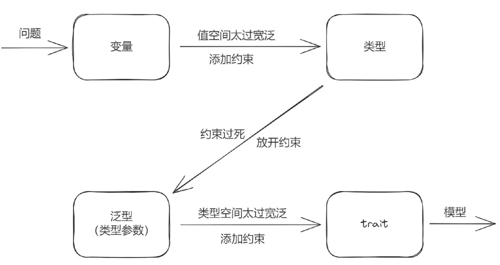

# Struct & Trait

## Trait

- trait 是一种约束

举个例子

```rust
struct Point<T> { 
    x: T,
    y: T,
}
// Display 是对范型 T 的约束，需要具体的类型必须实现了 Display trait
fn print<T: std::fmt::Display>(p: Point<T>) {
    ...
}
```

类型是对变量值空间的约束



- trait 是一种能力配置

trait 对类型参数实施约束的同时，也对具体的类型提供了能力, 同时 trait 也具备组合能力

```rust
T: TraitA + TraitB + TraitC + TraitD
```

### trait 包含哪些内容

- 关联函数

在 trait 中定义的函数，第一个参数不是 Self 类型，实现在这个 trait 上，有点类似 Java Interfact 中的静态方法；此外，trait 中的关联函数都可以有默认实现。

- 关联类型

在 trait 中，可以带一个或多个关联类型。关联类型起一种**类型占位功能**，定义 trait 时声明，在把 trait 实现到类型上的时候为其指定具体的类型。比如：

```rust
trait Sport {
    type ST;
    fn play(&self, sportType: Self::ST);
}

struct Basketball;
enum SportType {
    Land,
    Water,
}

impl Sport for Basketball {
    type ST = SportType;
    fn play(&self, sportType: Self::ST) { ... }
}

fn main() {
    let b = Basketball;
    b.play(SportType::Land);
}
```

- 在 T 上使用关联类型

```rust
trait TraitA {
    type: Scope;
}
// 在 T 上使用关联类型，p 被限定为实现了 TraitA 的类型上的关联类型
fn doo<T: TraitA>(p: T::Scope) { ... }
struct TypeA;
impl TraitA for TypeA {
    type Scope = String;
}

fn main() {
    doo::<TypeA>("hello".to_string());
}
```

- 在约束中具化关联类型

在指定约束的时候，可以把关联类型具化。

```rust
trait TraitA {
    type: Entry;
}
// 这里对 T 做了具化
// 限制必须实现了 TraitA，而且它的关联类型必须是 String 才能代入这个 T
struct Foo<T: TraitA<Entry=String>> {
    x: T,
}
Struct A;
impl TraitA for A {
    type Entry = String;
}

fn main() {
    let a = Foo {
        x: A,
    };
}
```

- 对关联类型的约束

在定义关联类型的时候，也可以给关联类型添加约束。意思是后面在具化这个类型的时候，那些类型必须要满足于这些约束，或者说实现过这些约束。

```rust
trait TraitA {
    type Entry: Debug;
}
#[derive(Debug)]
struct A;

struct B;

impl TraitA for B {
    type Entry = A;
}
```

- 关联常量

```rust
trait TraitA {
    // 定义关联常量
    const LEN: u32 = 100;
}
struct A;
impl TraitA for A {
    // 再次重新定义
    const LEN: u32 = 101;
}

struct B;
// 使用 TraitA 默认的关联常量定义
impl TraitA for B {
}
```

### trait 作为一种协议

一旦 trait 定义好，它就相当于一条法律或协议，在实现它的各个类型之间，在团队协作中不同的开发者之间，都必须按照它定义的规范实施。这是强制性的，而且这种强制性是由 Rust 编译器来执行的。也就是说，如果你不想按这套协议来实施，那么你注定无法编译通过。

- Where

```rust
fn doo<T: TraitA + TraitB + TraitC + TraitD>(t: T) -> u32 { }


// 上面的定义可读性收到影响，可以这样来
fn doo<T>(t: T) -> u32
where
    T: TraitA + TraitB + TraitC + TraitD
{ ... }
```

- 约束依赖

```rust
// 对 Cirle 这个 trait 添加约束依赖
// 如果某种类型要实现 Cirle，那么它也要同时实现 Shape
trait Cirle: Shape { ... }
```

- 约束中同名方法的访问

```rust
trait Writer {
    fn write(&self) {
      println!("top");
    }
}

trait FileWriter: Writer {
    fn write(&self) {
        println!("middle");
    }
}

struct LocalFile;
impl Writer for LocalFile { ... }
impl FileWriter for LocalFile { ... }

impl LocalFile {
    fn write(&self) {
        println!("low");
    }
}
fn main() {
    let f = LocalFiel;
    f.write();
    // 完全限定语法
    // 如果 impl 和 impl trait 时有同名方法，用这个语法就可以明确区分出来
    <LocalFile As FileWriter>::write(&f);
    <LocalFile As Writer>::write(&f);
}
```

### trait 提供了寻找方法的范围

Rust 在一个实例上是怎么检查有没有某个方法的呢？

- 检查有没有直接在这个类型上实现这个方法。

- 检查有没有在这个类型上实现某个 trait，trait 中有这个方法。

约束可按需配置

有了 trait 这种能力配置机制，我们可以在需要的地方按需加载能力。需要什么能力就引入什么能力（提供对应的约束）。不需要一次性限制过死

### 孤儿规则

为了不导致混乱，Rust 要求在一个模块中，如果要对一个类型实现某个 trait，这个类型和这个 trait 其中必须有一个是在当前模块中定义的。

如果真的需要，可以使用 Newtype 模式

```rust
use std::fmt::Display;

struct MyU32(u32);    // 用 MyU32 代替 u32

impl Display for MyU32 {
  // 请实现完整
}

impl MyU32 {
    fn get(&self) -> u32 {  // 需要定义一个获取真实数据的方法
        self.0
    }
}
```

### Blanket Implementation

又叫做统一实现

```rust
trait TraitA {}
trait TraitB {}

// 意思是为所有实现了 TraitB 的类型统一实现 TraitA
impl<T: TraitB> TraitA for T {}  // 这里直接对T进行实现TraitA
```

trait 的引入是为了对泛型的类型空间进行约束，进入约束的同时也就提供了能力，约束与能力是一体两面。trait 中可以包含关联函数、关联类型和关联常量。

trait 定义好后，可以作为代码与代码之间、代码与开发者之间、开发者与开发者之间的强制性法律协议而存在，而这个法律的仲裁者就是 Rustc 编译器。

Rust 是一门面向约束编程的语言。面向约束是 Rust 中非常独特的设计，也是 Rust 的灵魂。简单地把 trait 当作其他语言中的 class 或 interface 去理解使用，是非常有害的。

### trait 上增加类型参数

```rust
trait TraitA<T> {}

impl<T> TraitA<T> for AType {

}
// or
impl TraitA<u8> for AType { ... }
```

表示这个 trait 里面的函数或方法，可能会用到这个类型参数。在定义 trait 的时候，还没确定这个类型参数的具体类型。要等到 impl 甚至使用类型方法的时候，才会具体化这个 T 的具体类型。

```rust
// 一个更复杂的例子
trait TraitA<T> { ... }
struct Atype<U> {
    a: U,
}
impl<T,U> TraitA<T> for Atype<U> {
    ...
}
```

### trait 类型参数的默认实现
